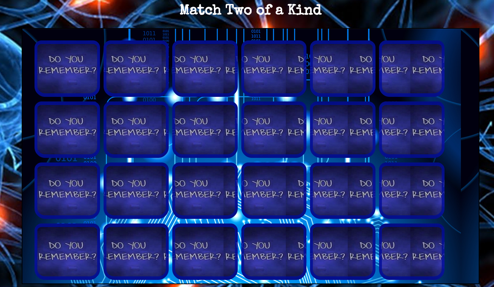

# Project-1 - Match Two of a Kind


## Synopsis:
A game built on the idea of boosting your memory and mental agility.  These types of activities added to daily or weekly routine not only is fun and boosts memory retention but can also protect against aging.  With all the late nights out and unhealthy things in New York, we have to find some way to keep our mind sharp.  </br> </br>Being a New Yorker, we always have to be alert. This game asks its participants to make adjustments based on new information and not go with associations. How fast can you adjust to new stimuli?




## Code Example
```` ``` ````javascript```` ``` ````
      if ((memoryValues[0] == memoryValues[1] && document.getElementById(memoryID[0]).style.background === document.getElementById(memoryID[1]).style.background)
          || (document.getElementById(memoryID[0]).style.background === document.getElementById(memoryID[1]).style.background && cardfront.style.background !== "orange")){
           cardsFlipped += 2;
           memoryValues = [];
           memoryID =[];
           if (cardsFlipped == cardBacks.length){
            alert("Level 1 complete! Level 2 is WIP");
  ```` ``` ````

## Build Strategy
Originally I wanted to build a typical memory game where you match identical cards.  Once I wrote the logic from there then the next step was tobuild upon the game to change the rules to what I have presently showcased. Originally, I wanted to test my skill with Vanilla JS and only write game in Vanilla unfortunately, I had to use jQuery for some parts.
On the flip side, I am improving with my JQuery and I was able to use both together to get the result I wanted for the game.


## Technologies

For this project, I have used the following technologies:

HTML
CSS
Vanilla Javacript
JQuery
GitHub
Apple Preview(for editing)

## Future Improvements (not in any particular order)

add music to go along with the timer
show timer on screen instead of just having an alert after 60 seconds.
build more levels
add 3d flip card effect
fix the graphics on cards since adding more cards distorted image.

## Contributing
Stack Overflow 
W3 Schools
These resources really help with my syntax issues. Therefore I was able to write the extensive nested 
if statements which has majority of the parameters for whole game.


##Authors
Shantel Moore
